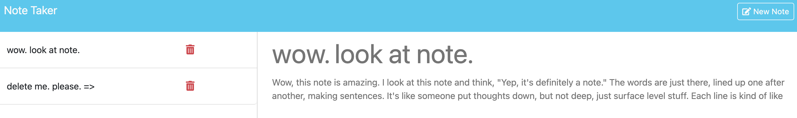

# Express Note Taker

Note taker app that allow adding notes, editing, and deleting. Meant as a project to learn how to use web servers and deploy.

## Table of Contents

- [Installation](#installation)
- [Usage](#usage)
- [License](#license)

## Installation

`npm i` to install

`npm start` to run

## Usage

If ran locally go to http://localhost:3000

If still maintained, https://express-note-taker-ivqt.onrender.com/ may work as well

## License

This project is licensed under the MIT License - see the [LICENSE.md](LICENSE.md) file for details.
